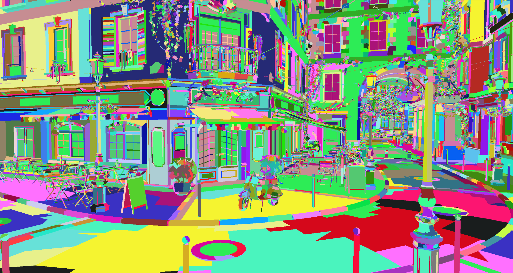
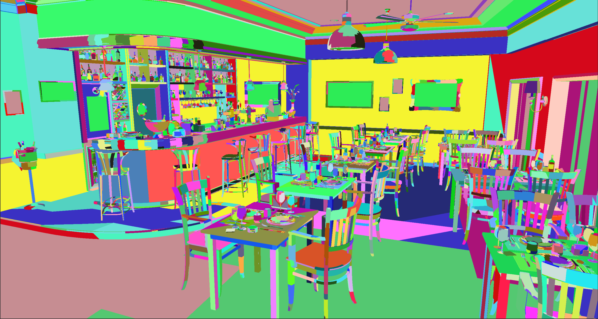

# Luden

D3D12 based hobby renderer.

Very much work in progress.

Project is made for mainly for learning about 3D engines design and architecture.

Note:
Repo does not provide model assets.

## Features:

- Renderer
    - Basic meshletizing
- Scene
    - loading and unloading JSON scenes at runtime,
    - adding models to scene at runtime,

## Requirements

- C++23
- Visual Studio 2022
- vcpkg
- DirectX Ultimate capable GPU

## Showcase

| Bistro exterior											| Bistro interior											|
| --------------------------------------------------------- | --------------------------------------------------------- |
| 	| 	|

<!---

--->

## Third-party

