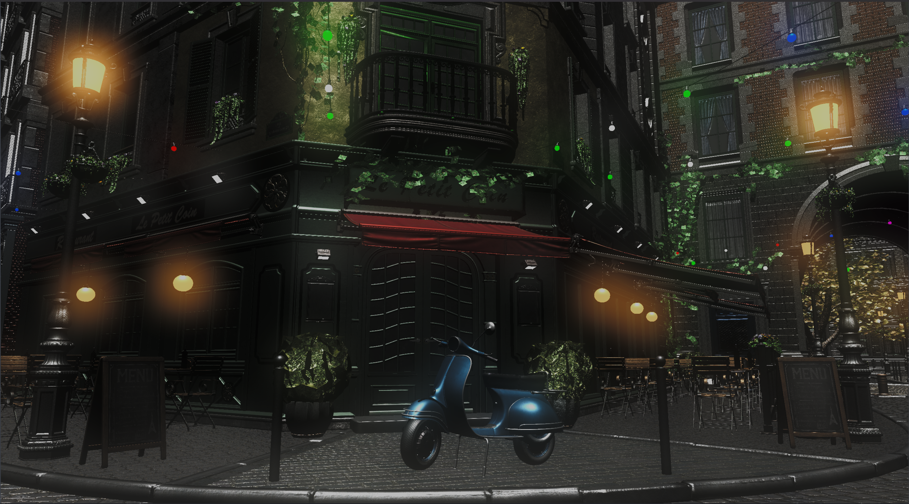
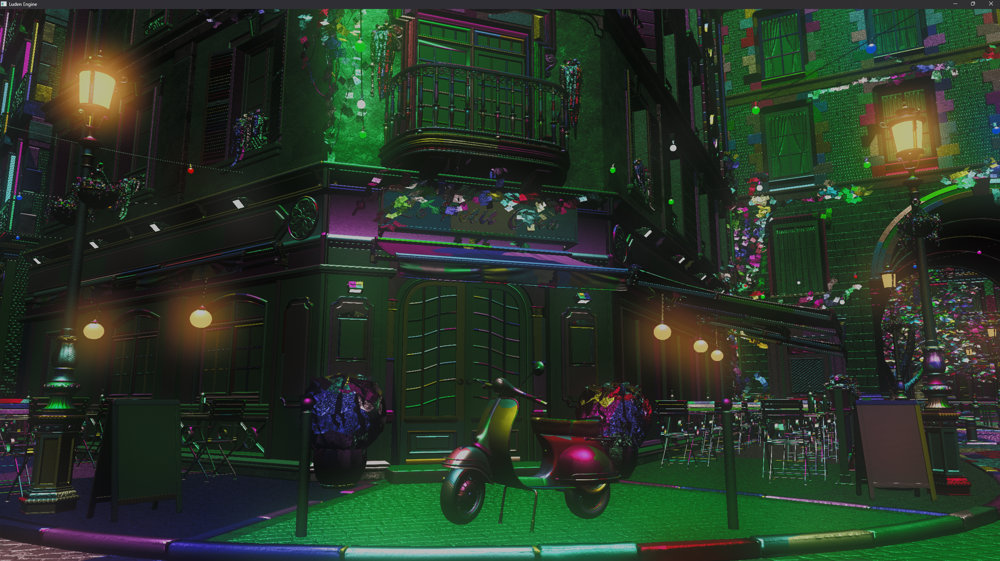

# Luden

D3D12 based hobby renderer.

Very much work in progress.

Project is made for mainly for learning about 3D engines design and architecture.

Note:
Repo does not provide model assets.

## Features:

- Renderer
	- Virtual geometry
	- GPU Meshlet culling
	- Deferred rendering
	- Bindless resources
	- Post-Process:
		- [x] Bloom
		- [x] FXAA
		- [ ] Screen Space Reflections - WIP
		- [ ] Screen Space Ambient Occlusion - WIP
		- [x] Tonemapping:
			- [x] ACES
			- [x] AgX
			- [x] Reinhard
			- [x] Gamma Correction
			- [x] Uncharted2
- Scene
	- Loading and unloading JSON-based scenes at runtime
	- Adding models to scene at runtime

- Editor
	- ImGui based editor layer

## Tech

- C++23
- Visual Studio 2022
- vcpkg
- DirectX Ultimate capable GPU

## Showcase

| Bistro exterior - deferred								| Bistro exterior - meshlets								|
| --------------------------------------------------------- | --------------------------------------------------------- |
| 				| 			|

## Third-party

- [ImGui](https://github.com/ocornut/imgui)
- [assimp](https://github.com/assimp/assimp)
- [fastgltf](https://github.com/spnda/fastgltf)
- [meshoptimizer](https://github.com/zeux/meshoptimizer)
- [EnTT](https://github.com/skypjack/entt)
- [D3D12MemoryAlloctor](https://github.com/GPUOpen-LibrariesAndSDKs/D3D12MemoryAllocator)
- [DirectXTex](https://github.com/microsoft/DirectXTex)
- [json](https://github.com/nlohmann/json)
